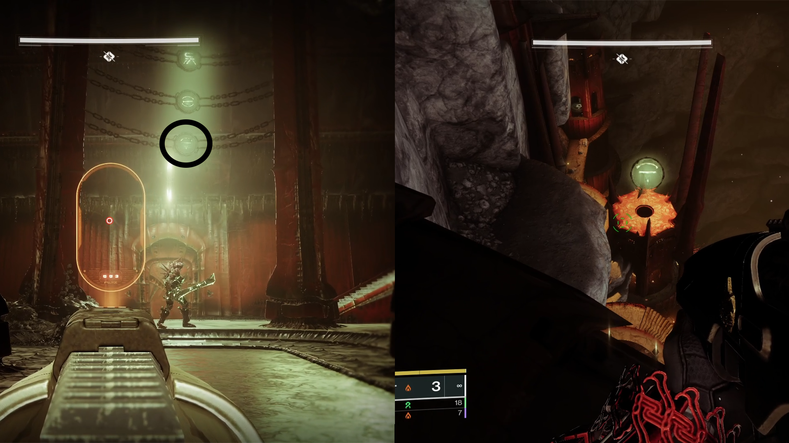
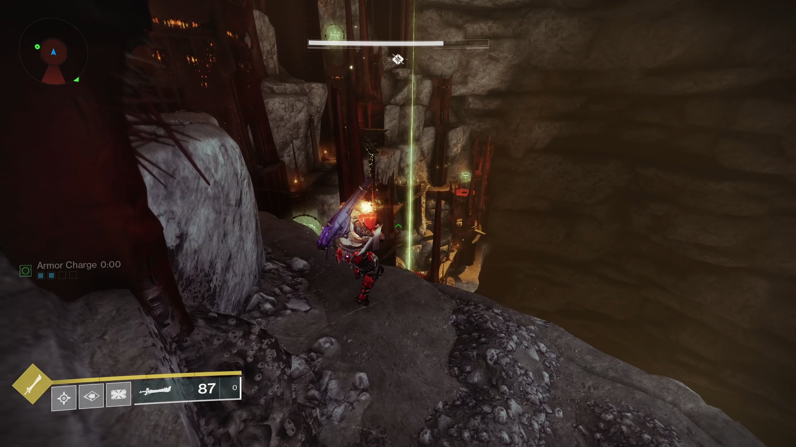

> [!tl-dr] tl;dr  
> - Travel to a nearby building
> - Look at the symbols
> - Find the buildings matching those symbols
> - Take a relic sword and defeat the enemies inside

___

## Notes

### Team Setup

There's not much of a team specific setup here really. Everyone is either on their own or grouped up, dealer's choice.

> [!sherpa] Sherpa Notes  
> If you're guiding New Lights through this for the first time, it's probably best to all group up so you can teach them the symbol callouts and how the relic sword works.

### Details

Take a moment to scan the area to see what's around. You don't have to memorize the landscape, but getting a feel for where the bridges and elevators are, where the buildings are, etc can help with navigating things. Keep in mind that the symbols you need to find will change each time you're here.

### Loadouts

Decent add clear and a good special weapon for the **Accursed Swordbearers** and **Blistered Ogres**.

----

## Rock-Paper-Scissors

Ah yes, the Scarlet Keep. An old but familiar location from Shadowkeep. This time we're heading straight for the back of the room where there's a crystal and a Hive barrier blocking a hole that will open up momentarily.

When your fireteam drops down, you'll navigate through some creepy dark tunnels until you find yourselves by a rally point and a vast cavern with a Hive city built into it.

The first thing to do is locate the building with the A symbol above it and peak inside the door. It'll be towards the right from the rally banner, down from the ledge. There's going to be an **Accursed Swordbearer** there just hanging out and minding his business. Murderize him and take his sword.

Above where is now corpse is, you'll notice three seals bound in chains. Breaking these is the main goal here.

How do we do that? Well you just have to match the symbols found here to the buildings throughout the cavern.

For example, if you have **Burger**, **Ice Cream**, and **A**, you'll locate the buildings with those symbols above them.

<figure markdown="span">
  { width="700" }
  <figcaption>Matching Ice Cream Seals</figcaption>
</figure>

—

It doesn't really matter which order you do these in, but let's just start from the first building in our example, **Burger**.

When you get to **Burger**, you'll notice that the entrance is walled off by a Hive barrier. Damn. Opening the door is easy though, just kill the **Pit Keeper** nearby and bam, it's open.

Inside you'll find either a **Knight**, **Wizard**, or **Shrieker**. Each one of them can only be killed by the relic sword in a specific manner. I mentioned what to do in the [intro](./index.md), but I'll repeat it here for ease of access:

=== "Knight (Might of the Broken Blade)"  
	Use the light attack of the sword to murderize it.

=== "Wizard (Omen of the Broken Blade)"  
	Use the heavy attack to shoot waves of energy at it.

=== "Shrieker (Oracle of the Broken Blade)"  
	Use the guard to reflect its blasts back at it. Fun fact, you can also reflect the blasts from ogres with this.

> [!careful] What Do You Mean Immune?!  
> It bears reiterating that the only way to kill these particular enemies is to use the relic sword dropped by an **Accursed Swordbearer**. Any other weapon or ability will not do a damn thing.
>
> The relic sword has a limited number of uses as well. Pay attention to the ammo! If you need another sword, go to one of the bridges close by and wait for another **Accursed Swordbearer** to spawn. If you don't feel like waiting, you can typically find one in a building with a symbol that doesn't match one of the ones you need.

Fantastic! It's dead! Huzzah! After you kill it, notice that one of the three seals has disappeared. That means you only have two more to go!

From here you'll go to **Ice Cream** and then **A** to do the same thing. Just be careful of the **Blistered Ogres** along the way. They'll usually be on the same bridges as the **Accursed Swordbearers** and can be very annoying. If you want to be cheeky though, you can use the relic sword's block ability to reflect its blasts back at it. Very fun.

—

Once all three seals are broken, one of the buildings in the area will have a beacon of green light above it. Head to this building to get some sweet loot and move forward.

<figure markdown="span">
  { width="700" }
  <figcaption>Beam of light showing the exit.</figcaption>
</figure>

On the way to the next encounter you'll find another cavern with a series of doors. I'm not gonna tell you which entrance to go in as it's honestly funnier to figure it out on your own. Sorry.

