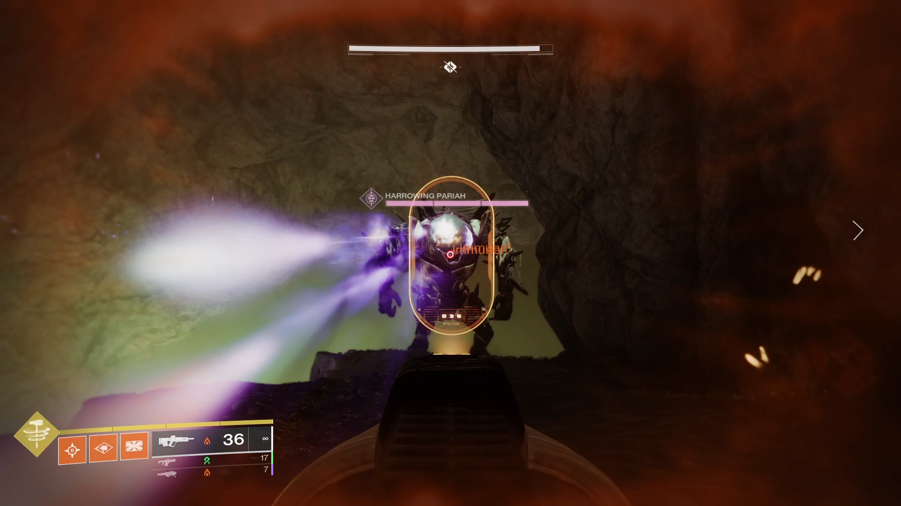
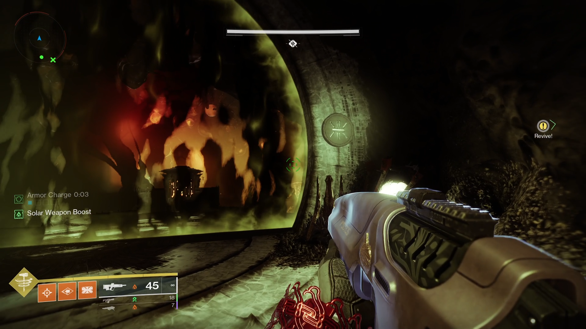

> [!tl-dr] tl;dr  
> - Navigate through hidden passages to locate and kill **Knights** and take a **Void Charge**.
> - Take **Void Charge** to one of the three dunk points in the left, middle, or right area and deposit to break a seal
> - Do this once for each section to break all three seals and move forward.

___

## Notes

### Team Setup

Like the last encounter, there's not really a specific team composition here. Everyone can either do things one at a time as a group or all at once individually. Same **Sherpa Note** applies too.

### Details

This area can be really easy to get lost in until you're more familiar with it. Take your time getting used to going in and out of the internal passages and where they lead. Also look out for the entrances to these passages. They look like small holes with orange cloth over them that you have to destroy to open up.

This is also a good time to learn where you need to deposit the **Void Charges**.

### Loadouts

Add clear and survivability

----

## Hidden Paths and Unkillable Fiends.

Well I'm glad you found the proper entrance to get here. Wasn't that fun? Or were you the type to figure it out in five seconds and not spend an hour trying to figure out where it was? If that was the case, ~~go to hell~~, congratulations!

Anyway, you'll see upon arriving that this area branches into three different tunnels going left, middle, and right. At the end of each of these is another Hive barrier with seals that we need to break.

So how do we do this?

Dunking, our favorite past time.

You'll also notice that we have two big friendly ogres called **Harrowing Pariahs**  wandering the area looking for intruders. Normally I'd say to murderize them, but these giant cuddly bastards are invincible and cannot be harmed.

<figure markdown="span">
  { width="700" }
  <figcaption>Our newest friend!</figcaption>
</figure>

—

What you'll want to do is pick a lane/branch and start to head that way. On the left and/or right you'll see small holes with orange cloth that I mentioned above that you can enter. A few of these are just connecting tunnels with nothing in them (aside from adds), but the others house a **Heretic Knight** that you should kill.

When it does, it will drop a **Void Charge**, which is what you need to deposit to extinguish the flame break one of the seals.

Take this charge, *carefully* peek out of one of the holes to see if you're in the clear, and book it to the end of the lane. Dunk the charge and a seal is broken.

<figure markdown="span">
  { width="700" }
  <figcaption>Extinguished flame and a remaining seal</figcaption>
</figure>

Now you just need to do this two more times to move forward. Easy enough, yeah? Honestly the hardest part is just navigating through everything without getting lost and making sure you don't get blasted by the ogres.

Move in to the next room to find a fun little prayer group happening.

