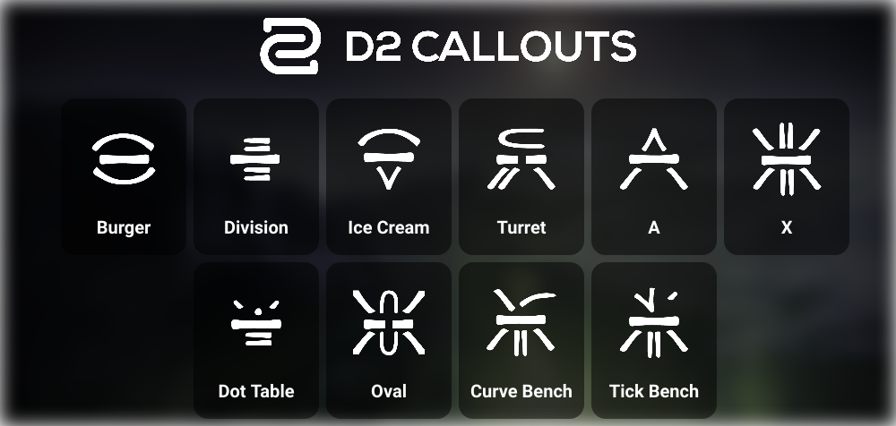

## Table of Contents

[Mechanics](#Mechanics)  
[Encounters](#Encounters)  

---

## Mechanics

So thankfully this dungeon is pretty consistent with its mechanics and they're fairly easy to navigate.

###### Callouts

You'll find with most Hive related encounters over the different seasons and DLC that there are various runes. As is tradition, each team has different callouts for them. Here are the ones I use:

In my experience with Pit, you won't be verbally calling these out a lot. However, they're still nice to know in case they need communicated.

Most times you'll see these emblems as seals in chains that need to be broken to move forward.

###### Dunking

There will be a number of times where you have to dunk a **Void Charge** into Hive containers to extinguish flames. Dunking these will break the seals mentioned above so the fireteam can progress through the dungeon.

###### Rock-Paper-Scissors

Listen, I get y'all are probably going to yell at me for the order I put those in, but I'm not going to change my ways. This is an important aspect in the first and final encounters where you need to defeat specific enemies called **The Disciples of the Broken Blade** by using a relic sword dropped by **Accursed Swordbearers**  in different ways:

=== "Knight (Might of the Broken Blade) "  
	Use the light attack of the sword to murderize it.

=== "Wizard (Omen of the Broken Blade)"  
	Use the heavy attack to shoot waves of energy at it.

=== "Shrieker (Oracle of the Broken Blade)"  
	Use the guard to reflect its blasts back at it. Fun fact, you can also reflect the blasts from ogres with this.

---

## Encounters

##### [The Necropolis](1-The-Necropolis.md)

A big city with symbols everywhere. Match the buildings to the seals you see inside one of them and play some Rock-Paper-Scissors!

##### [Tunnels of Despair](2-Tunnels-of-Despair.md)

Dunk **Void Charges** to extinguish flames and break more seals while you try not to get lost or run into some invincible ogres!

##### [Chamber of Suffering](3-Chamber-of-Suffering.md)

Just survive. Really, that's it. Just make it out of there alive. Oh also make sure to dunk those **Void Charges** while you're at it. One more thing, don't leave the totem.

##### [The Harrow](4-The-Harrow.md)

Get lost in a maze full of traps and kill some Wizards. Have fun!

##### [Zulmak, Instrument of Torment](5-Zulmak.md)

A fun combo of everything we've done thus far! Murder Disciples, dunk charges, torment the tormentor!