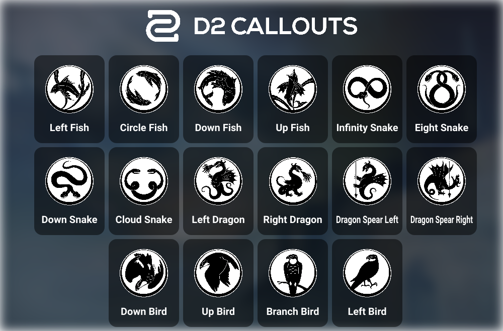

---  
title: Introduction to Last Wish  
activity_type:  
  - Raid  
activity_name: Last Wish  
aliases:  
  - Last Wish Intro  
share: "true"  
---  
  
----  
  
## Table of Contents  
  
[Mechanics](#mechanics)
[Encounters](#encounters)
[Bonus Chests](#bonus-chests)
[Tools](#tools)
  
----  
  
## Mechanics  
  
So, in my opinion, Last Wish doesn't really have a consistent set of building mechanics like others do. However, you'll see the same bits and pieces pop up every so often.  
  
**Symbols:** One thing that appears often are sets of symbols with either a bird, snake, fish, or dragon in black on a pale green background. Here are the ones I personally use:  
  

  
**Taken Blights**: in a few encounter you'll see some taken orbs in pillars of light. When these are picked up they give a **Taken Strength** debuff which will kill you if you get more than two stacks.  
  
**Plates**: I mean really, that's what they are. These are floating platforms you stand on that will hurt you over time.  
  
Also there's a **Wishing Wall** found past Kalli's arena after you jump up some rocks:  
  
![[../assets/img/LW-Wishing-Wall.jpeg|The Wishing Wall]]  
  
---  
  
## Encounters  
  
##### [Kalli, the Corrupted](1-Kalli.md)
  
Let's match some symbols, cleanse some plates, and hide in closets!  
  
##### [Shuro Chi, the Corrupted](2-Shuro-Chi.md)
  
Laser almonds and puzzles abound!  
  
##### [Morgeth, the Spirekeeper](3-Morgeth.md)
  
Take strength, get buffs, kill kill kill  
  
##### [The Vault](4-The-Goddamn-Vault.md) 
  
Oh God oh fuck.  
  
##### [Riven of a Thousand Voices](5-Riven.md)

Poke her toes or shoot her face, cheese style!  
  
##### [Riven's Heart](6-Queenswalk.md) 
  
Carry an orb in a relay race, take strengths, hope for the best!  
  
----  
  
## Bonus Chests  
  
First one right after Kalli below one of the thin platforms you have to cross. You'll have to jump down and land in the entrance. It'll take a few tries  
  
Second one is right after Shuro Chi, on a cliff. When you see the portal to Morgeth, you've gone slightly too far. It'll be out of one of the side doors where you have to jump up some trees and over a gap to get to.  
  
----  
  
## Tools  
  
This is a *really* helpful tool for the Vault encounter.  
  
https://the-vault.netlify.app/  
